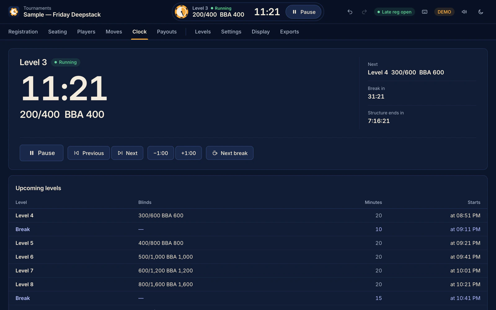
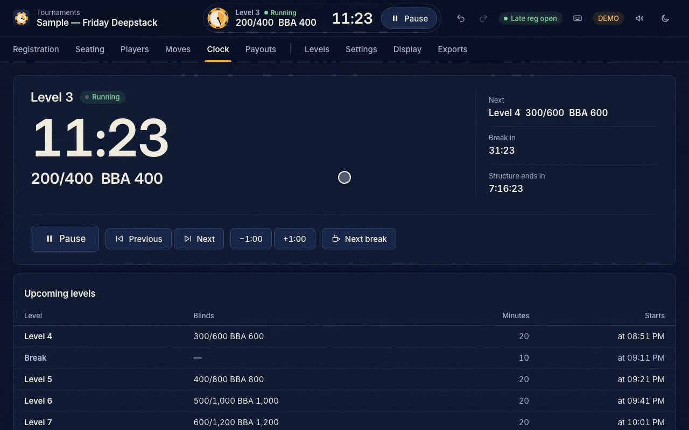
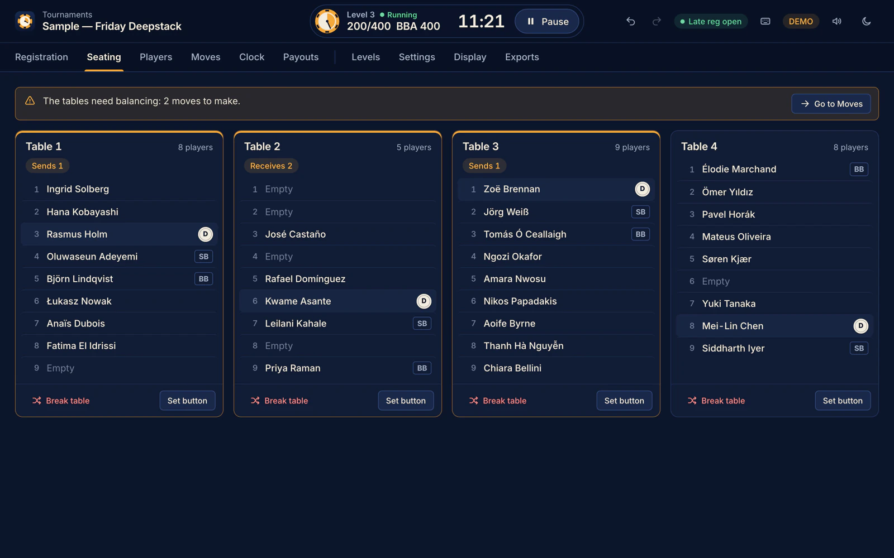
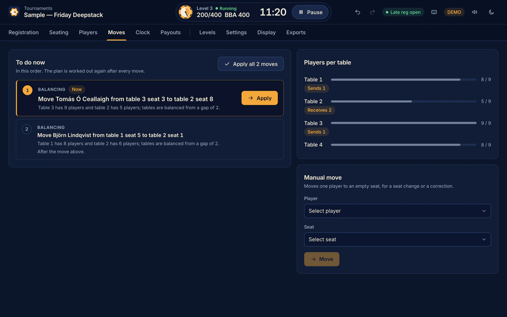
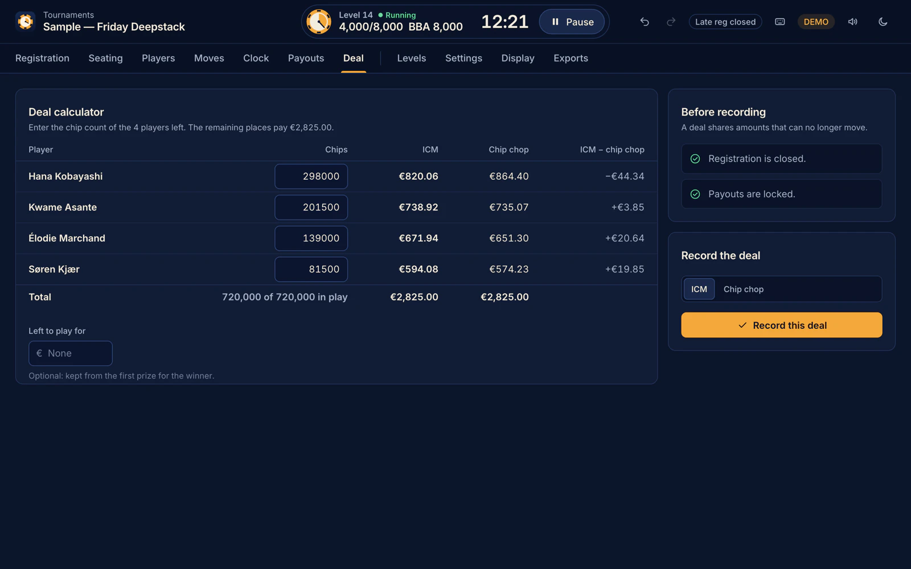
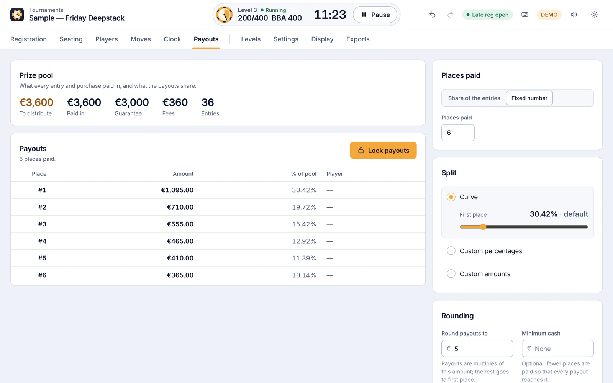
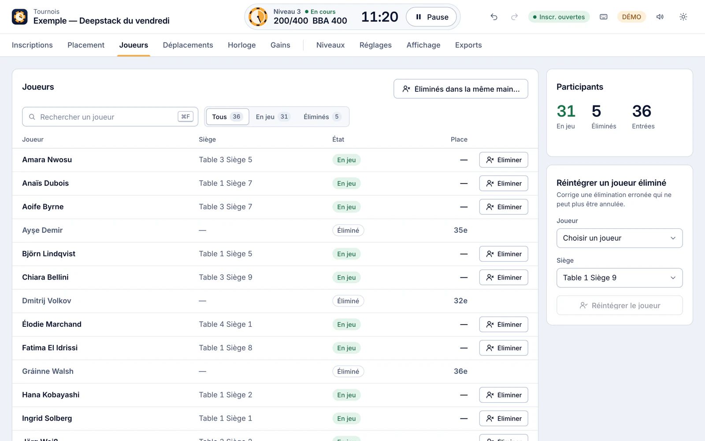

# MTT Tournament Director

[](https://github.com/maynetee/MTT/actions/workflows/ci.yml)
[](LICENSE)

A free, open-source director for live poker tournaments that runs on your own computer: clock,
registration, seating and table balancing, eliminations, payouts and deals, and a TV display for
the room. In English and French, for macOS, Windows and Linux, or in your browser.



[Download the desktop app](#download-and-install), or try it in your browser at
<https://maynetee.github.io/MTT/>: **Try a sample tournament** opens a tournament in progress
with 36 fictional players, so every screen has something to show.

## See it run



The clock runs, the TV display opens, a player is eliminated (Undo is one click away), and the
balancing plan moves a player to the short table. Also available as an
[MP4 video](docs/images/demo.mp4).

## Features

### Tournament clock

- The clock is stored as a point in time ("level 4 ends at 21:40"), not as a counter that
  ticks. It never drifts, keeps running through a restart of the app, and every window shows
  the same time.
- Levels and breaks follow each other on their own. Antes can be classic or big blind ante.
- Start, pause, previous and next level, one minute more or less, jump to the next break, and
  the start time of every upcoming level.
- When the structure runs out, the last level stays on and overtime counts up: the blinds never
  change without the director. The app warns when two levels or fewer are left and once the
  structure is over, and flags an ante above the big blind or blinds that go down.
- The structure can be edited while the tournament runs: levels already played are frozen and
  the current level keeps its elapsed time.
- Structure presets for a new tournament: Turbo (10-minute levels), Regular (20) and Deepstack
  (30), built from the starting stack: a first big blind of 1/100 to 1/200 of the stack, big
  blind ante from level 1 or 2, a break with a color-up about every two hours, and at least ten
  hours of levels. A preview gives the total duration and the level and average stack in big
  blinds at the start and after two and four hours.

### Level sounds

- A chime at each new level, at the start and the end of each break, and a warning one minute
  before the end of each level or break. The tones are generated by the app, with no sound
  files.
- Sounds follow the clock and play once per level: a reload or an undo never plays one again,
  and only one window plays them.
- Sound on or off, the volume and which window plays (the display window while it is open, the
  director's window otherwise, or a fixed choice) are in Preferences, saved on this computer.

### Registration and late registration

- Register players by name (the same name twice is refused, whatever the case). Each player is
  seated at once by a random draw at the table with the fewest players, or at a seat you choose.
- Late registration closes at the end of a given play level (optionally through the break that
  follows), after a given playing time, or when you close it. You can close or reopen it at any
  time; the remaining time is shown while it is open.
- Players can be unregistered until the tournament starts.

### Seating and table balancing

Seating follows the practice of the [TDA rules](https://www.pokertda.com/):

- Each table has a dealer button, set with a click on its seat, and the app shows who posts the
  next small and big blind (heads-up included).
- The Moves tab lists what to do, in order: form the final table, break a table, then each
  balancing move, every item with the numbers that explain it. The plan is worked out again
  after every move.
- When the largest and the smallest table differ by two players or more (configurable), the
  player due for the big blind at the largest table goes to the worst position at the smallest
  table. Apply the moves one by one or all at once. A table whose button is unknown is asked
  for, seat by seat, instead of guessed.
- A table break is suggested as soon as the other tables can seat everyone; the preview shows
  who moves and where seats are free, and its players are dealt at random to the tables with
  the fewest players.
- Final table: every remaining player is redrawn to a random seat at the final table, the other
  tables close, and the app asks for the button after the high-card draw.
- After a break, a final-table draw or balancing, the moves to announce are listed in large
  type, and can be copied as text or printed on a sheet of their own.
- Players can also be moved by hand to any free seat, and more tables opened.





### Eliminations and ranking

- Eliminate one player, or several in the same hand: the player who started the hand with more
  chips finishes higher, and equal stacks tie and share the place.
- After an elimination, a notification offers to undo it.
- Live ranking with ties, provisional places while players can still come in, places paid,
  bubble and in-the-money status.
- A wrong elimination that can no longer be undone can be corrected.
- The tournament ends by itself when one player is left and no one else can enter.

### Money, payouts and deals

Money tracking is optional: leave it off for a free or home game.

- Buy-in split into prize and fee, in one of 36 currencies, with an optional guarantee: the
  prize pool, the fees, the guarantee and any overlay are always in view. Every entry records
  the price it paid, so changing the buy-in never rewrites history, and amounts are exact to the
  smallest unit of the currency.
- Re-entries, rebuys and add-ons, each with its price, chips, limit per player and window
  (while registration is open, until a level or a playing time, or during the break after a
  given level). The players screen offers them when they are open.
- Payouts: places paid as a share of the entries or a fixed number; amounts from a curve with
  an adjustable first-place share, custom percentages or custom amounts; rounding (the rest
  goes to first place) and a minimum cash. Lock the payouts so that later entries leave them
  as they are; the app tells you when locked payouts no longer match the prize pool. Tied
  players share the prizes of the places they cover.
- Deal calculator, once 20 players or fewer are left: enter the chip counts, and optionally an
  amount to keep aside for the winner, to compare ICM and chip chop side by side. Record the
  deal (registration closed and payouts locked first): the agreed amounts become the players'
  prizes and play goes on for the rest.





### TV display

- A second window for the room, laid out for a TV across the room on a 16:9 stage that scales
  to any screen: the time left in large digits that never shift, blinds and ante, next level,
  time to the break, late registration, players and entries, average stack in chips and big
  blinds, and chips in play. With money tracking, the prize pool and a payout ladder that
  points at the next payout or the minimum cash.
- Bubble and in-the-money status; paused, break (with the color-up), last level, overtime and
  the winner each have a look of their own.
- On the desktop it opens fullscreen on the second screen when there is one, and comes back to
  the front if it is already open; in the browser it opens in a tab of its own. Moving the mouse
  shows an exit button, and Esc closes it. It follows every change made in the director window.


### Undo and redo

Every action can be undone and redone: registrations, eliminations, moves, clock changes,
settings, payouts and deals. The buttons say what they will undo or redo. Deleting a tournament,
breaking a table, drawing the final table, closing registration early and changing the structure
during play ask for confirmation first.

### Exports

- The ranking as CSV (UTF-8, opens correctly in Excel) or PDF, with a prize column when money is
  tracked. The PDF embeds the Inter font, so names with accented Latin, Greek or Cyrillic
  letters print as typed.
- The desktop app asks where to save the file; the browser downloads it.

### Tournaments and data

- As many tournaments as you like: create, open, duplicate (same settings and structure, no
  players) and delete them. The list shows the most recently changed first, with each one's
  status, players and players in play; past eight tournaments, a search field and a status
  filter appear.
- Try a sample tournament: one click builds a tournament in progress with 36 fictional players
  at four tables of nine, buttons set, a big blind ante structure with breaks, a EUR 100 + 10
  buy-in with a guarantee, and the clock running in level 3 after five eliminations.
- Import from the previous version: on a fresh install, if the desktop app finds a tournament
  left by the previous version of MTT Tournament Director, it offers to import it (structure,
  players, seats, eliminations and clock). The old database is only read, never changed.

### Languages and themes

- English and French. The app speaks French when the first language of the system it knows is
  French, English otherwise; Preferences switches it for this computer, and an open display
  follows at once.
- Light and dark themes drawn from the app icon, following the system unless you choose one.
  The TV display is always dark.
- Keyboard shortcuts for the clock, undo and redo, the tabs and the windows (see below), a skip
  link, and notifications announced to screen readers. Animations stop when the system asks
  for reduced motion.



### Privacy

Everything stays on your computer: no account, no server, no telemetry. The desktop app keeps
all tournaments in one SQLite file, `mtt.sqlite`, in its data folder:

| System  | Data folder                                                              |
| ------- | ------------------------------------------------------------------------ |
| macOS   | `~/Library/Application Support/com.maynetee.mtt`                         |
| Windows | `%APPDATA%\com.maynetee.mtt`                                             |
| Linux   | `~/.local/share/com.maynetee.mtt` (or `$XDG_DATA_HOME/com.maynetee.mtt`) |

To back up your tournaments, copy that file while the app is closed.

## Download and install

Installers are attached to each release on the
[Releases page](https://github.com/maynetee/MTT/releases), and [CHANGELOG.md](CHANGELOG.md)
lists what changed in each one:

| System                                | File                                       |
| ------------------------------------- | ------------------------------------------ |
| macOS (Apple silicon and Intel)       | `.dmg` (universal)                         |
| Windows (x64)                         | `-setup.exe` installer, or `.msi`          |
| Linux (x64)                           | `.AppImage`, `.deb` or `.rpm`              |

### The builds are not code-signed yet

Your system will warn you the first time you open the app.

**macOS 15 (Sequoia) and later.** Control-click › Open no longer bypasses Gatekeeper.

1. Open the app once. macOS refuses to open it: click **Done**.
2. Open **System Settings › Privacy & Security**, scroll down to the message about
   MTT Tournament Director and click **Open Anyway**, then confirm.

If macOS still refuses, remove the quarantine flag in Terminal:

```sh
xattr -dr com.apple.quarantine "/Applications/MTT Tournament Director.app"
```

**Windows.** If SmartScreen shows "Windows protected your PC", click **More info**, then
**Run anyway**.

**Linux.** Make the AppImage executable, then run it:

```sh
chmod +x MTT*.AppImage
./MTT*.AppImage
```

On Ubuntu 24.04, AppImages need FUSE 2: `sudo apt install libfuse2t64`.

## Browser demo

<https://maynetee.github.io/MTT/> runs the same engine as the desktop app, compiled to
WebAssembly, directly in the page. Nothing is sent to a server: tournaments are saved in your
browser's storage for that site, so they stay in that browser only and disappear if you clear
its site data. The import from the previous version is only available in the desktop app. For
a real event, prefer the desktop app, which keeps your tournaments in a file you can back up.

## Keyboard shortcuts

In a tournament, press `?` (or the keyboard button in the header) to list the shortcuts with the
keys of your system. They do nothing while you type in a field or while a dialog is open (Esc
excepted), and holding a key down does not repeat them.

| Keys                        | Action                                 |
| --------------------------- | -------------------------------------- |
| Space                       | Start or pause the clock               |
| N                           | Next level                             |
| P                           | Previous level                         |
| + (or =)                    | Add one minute                         |
| - (minus)                   | Take one minute off                    |
| B                           | Jump to the next break                 |
| ⌘Z or Ctrl+Z                | Undo the last action                   |
| ⇧⌘Z, Ctrl+Shift+Z or Ctrl+Y | Redo                                   |
| 1 to 9                      | Go to a tab, in the order shown        |
| D                           | Open the display window                |
| F                           | Full screen on or off                  |
| Esc                         | Leave full screen, close a dialog      |
| ?                           | Show the shortcuts                     |

On some screens:

| Keys         | Action                  | Where            |
| ------------ | ----------------------- | ---------------- |
| ⌘F or Ctrl+F | Search the players      | Players tab      |
| Enter        | Register the name typed | Registration tab |
| Esc          | Close the display       | Display window   |

## Build from source

Prerequisites:

- [Node.js](https://nodejs.org/) 24 LTS (the version in [`.nvmrc`](.nvmrc): `nvm use`) and npm.
- [Rust](https://rustup.rs/) through rustup: [`rust-toolchain.toml`](rust-toolchain.toml) pins
  the version, with rustfmt, clippy and the `wasm32-unknown-unknown` target. rustup installs it
  the first time you run `cargo` in the repository (or run `rustup toolchain install`).
- [wasm-pack](https://github.com/drager/wasm-pack) for the WebAssembly engine:
  `cargo install wasm-pack --locked`.
- For the desktop app, the [Tauri 2 prerequisites](https://v2.tauri.app/start/prerequisites/)
  of your system.

```sh
npm ci                    # install the JavaScript dependencies
npm run tauri dev         # desktop app, reloads on change
npm run dev               # browser build only, at http://localhost:1420
npm test                  # front-end tests (Vitest), core scenarios through WebAssembly included
cargo test --workspace    # Rust tests; also regenerates the TypeScript types in src/bindings
npm run tauri build       # installers for your system, in target/release/bundle
```

`npm run wasm` builds the WebAssembly engine into `src/wasm/pkg`; `dev`, `build`, `typecheck`
and `test` rebuild it first when it is missing or older than the Rust sources.

During development, point the desktop app at a throwaway data folder so your real tournaments
stay untouched (debug builds only: the released app ignores `MTT_DATA_DIR`):

```sh
MTT_DATA_DIR=/tmp/mtt-dev npm run tauri dev
```

In PowerShell: `$env:MTT_DATA_DIR = "$env:TEMP\mtt-dev"; npm run tauri dev`.

## Architecture

- `crates/mtt-core`: the tournament rules in pure, deterministic Rust. Every action is a command
  turned into one recorded event; the state is rebuilt by replaying the events, which gives undo
  and redo. No I/O, no clock, no randomness of its own.
- `src-tauri`: the desktop host. Runs the core behind Tauri commands and keeps each tournament's
  event log in SQLite.
- `crates/mtt-wasm`: the browser host. The same core compiled to WebAssembly, logs kept in
  `localStorage`.
- `src`: the React and TypeScript interface. It talks to either host through one `Engine`
  interface (`src/engine`), with types generated from the Rust code (`src/bindings`).

Details for contributors: [docs/architecture.md](docs/architecture.md) and the core
specification, [docs/design/core-spec.md](docs/design/core-spec.md).

## Contributing

Bug reports, ideas and pull requests are welcome: see [CONTRIBUTING.md](CONTRIBUTING.md).

## License

[MIT](LICENSE) © 2026 Mendel Teichman

## Credits

- [Inter](https://github.com/rsms/inter) by The Inter Project Authors, under the
  [SIL Open Font License 1.1](src/assets/fonts/OFL.txt), for the interface and the PDF exports.
- Seating, balancing and ranking follow the rules of the
  [Poker Tournament Directors Association](https://www.pokertda.com/). This project is not
  affiliated with the TDA.
