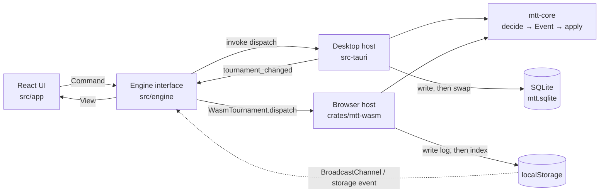

# Architecture

This document is for contributors. It explains how MTT Tournament Director is put together, why
it is built that way, and what to touch when you add a feature. The tournament rules themselves
(seating, balancing, ranking, payouts, clock arithmetic, error codes) are specified in
[design/core-spec.md](design/core-spec.md).

## The pieces

| Path | Responsibility |
| --- | --- |
| `crates/mtt-core` | The domain core: every rule of the tournament, in pure and deterministic Rust. No I/O, clock or entropy. |
| `src-tauri` | Desktop host (crate `mtt`): runs the core behind Tauri commands, stores event logs in SQLite, opens the display window, saves exports, imports the previous version's data. |
| `crates/mtt-wasm` | Browser host: the same core compiled to WebAssembly with wasm-bindgen, JSON in and out. |
| `src/engine` | The `Engine` interface the UI talks to, with one implementation per host (`TauriEngine`, `WasmEngine`). |
| `src/app` | React screens, hooks and utilities (CSV and PDF exports, labels). No tournament rule lives here. |
| `src/bindings` | TypeScript types generated from the Rust types by [ts-rs](https://github.com/Aleph-Alpha/ts-rs). Never edited by hand. |
| `src/i18n` | Messages in English (`en.ts`) and French (`fr.ts`), including one message per error code (`errors.<CODE>`) and warning; the language of the device (`language.ts`). |
| `scripts/wasm.mjs` | Builds `crates/mtt-wasm` into `src/wasm/pkg` with wasm-pack (`npm run wasm`). |

The Cargo workspace holds the three crates. `mtt-core` depends only on serde, serde_json,
unicode-normalization and libm (plus ts-rs, optional, for the TypeScript bindings).

## Data flow



Every change follows the same path: the UI sends a `Command`, the host passes it to the core
with the current time and a fresh random seed, persists what the core recorded, and returns the
new `View`. Every window then refetches its view when told that the tournament changed.

## Event sourcing

### Commands, events, state

- A `Command` (`crates/mtt-core/src/command.rs`) is an intention: `register`, `bust_players`,
  `start_clock`, `break_table`, and so on.
- `decide(&State, &Command, &Ctx) -> Result<Event, DomainError>` (`decide.rs`) validates the
  command and resolves everything that depends on time or chance. The result is exactly one
  `Event` (`event.rs`) that records outcomes, not intentions: the seat a player drew, the
  absolute clock after a pause, every seat change of a table break, the bust group.
- `apply(&mut State, &Event)` (`state.rs`) is pure: it never sees the time, never draws a random
  number and never rejects valid input. Replaying the same events always gives the same state.
- A rejected command returns a `DomainError` (`{"code": "NAME_TAKEN", "params": {...}}`) and
  leaves the aggregate unchanged. User input never panics.
- `view(&State, now_ms)` (`view.rs`) derives everything the screens show (clock, ranking,
  suggested moves, warnings) and is recomputed on demand. Nothing derived is stored.

`Aggregate` (`engine.rs`) holds the log, an undo cursor and the current state. Each event is
stored in an `Envelope { seq, v, atMs, event }`: `seq` is 1-based, `v` is `EVENT_VERSION`. A whole
log serializes as `SavedLog { format, head, events }`.

### Undo and redo

Undo and redo are a cursor, `head`, the number of active events:

- Undo moves `head` back by one and rebuilds the state by replaying `events[..head]` from the
  creation event. The creation itself cannot be undone. Undo works even once the tournament is
  finished.
- Redo re-applies `events[head]` and moves `head` forward.
- A new command after an undo drops the undone suffix (`Outcome::Recorded { discarded }`).

`dispatch` returns an `Outcome`: `recorded` (a new envelope), `undone { seq }` or
`redone { seq }`, which is all a host needs to persist. The view carries undo and redo labels
(event kind, player names, table) so the buttons can say what they will do.

### Why determinism matters

The log is the only source of truth. It must replay to the same state on every platform, in the
native and the WebAssembly build, and in every future version of the app. So:

- **Randomness comes from the host.** `Ctx.seed` is a fresh `u64` per command. The core draws
  with its own PCG32 (`rng.rs`, golden-tested against the reference output) and stores the
  outcome in the event, so replay never draws again. The desktop host gets the seed from the OS
  (`getrandom`); the browser host from `crypto.getRandomValues`, passed as a decimal string
  because a JavaScript number holds only 53 bits.
- **Time comes from the host.** `Ctx.now_ms` is the wall clock in Unix milliseconds. The core
  never reads a clock; `apply` never sees time at all.
- **No floats in state, events or views.** Chips and money are `i64` newtypes (money in minor
  units) that stay within JavaScript's safe integer range. Floats only appear inside two pure
  computations, the payout curve weights and ICM, through `libm` so native and WebAssembly give
  the same bits, and their results are turned into integers at once.
- **No hash-ordered collections.** Clippy's `disallowed-types` (`crates/mtt-core/clippy.toml`)
  forbids `HashMap` and `HashSet`; the core uses `BTreeMap` and `BTreeSet`.
- `#![forbid(unsafe_code)]` and no I/O in the core.

The wire format is frozen: every command and event variant has an explicit `#[serde(rename)]`,
new fields are optional with `#[serde(default)]`, and a log written by an older version is
upgraded by `event::upcast` before replay. `crates/mtt-core/tests/golden/v1_log.json` must keep
replaying unchanged.

## The clock

The clock is stored as one of two states (`clock.rs`):

- `Running { level, endsAtMs }`: level `level` ends at wall-clock time `endsAtMs`; the next levels
  follow back to back.
- `Paused { level, remainingMs }`.

Nothing is written as time passes: there are no tick events. `effective(clock, levels, now)`
derives the current level by walking forward from `endsAtMs` while `now` is past the end of a
level. On the last level the clock stays at 0 remaining and counts `overtimeMs`; the blinds never
change without the director. Because level changes are derived, undo is never stuck behind an
automatic level change, and the clock is right after a restart or a crash.

```text
Structure:  L1 20 min | L2 20 min | Break 10 min | L3 20 min (last level)

StartClock at T         records Running { level: 0, endsAtMs: T+20m }  (one event)

Without any other command, the level is derived from the wall clock:

  wall clock  T ------- T+20m ------- T+40m ------- T+50m ------- T+70m ------->
  effective   |   L1    |     L2      |    Break    |     L3      | overtime...
                                                                    remaining 0

With a pause during L2:

PauseClock at T+25m     records Paused  { level: 1, remainingMs: 15m }
StartClock at T+30m     records Running { level: 1, endsAtMs: T+45m }
```

Every clock command (`start_clock`, `pause_clock`, `next_level`, `prev_level`, `jump_to`,
`jump_to_next_break`, `adjust_time`, `set_remaining`) reads the effective clock at `ctx.now_ms`
and records the resulting absolute state in a `clock_changed` event. Undoing a clock change
restores the recorded clock, so undoing a pause taken five minutes ago resumes as if the pause
never happened.

The view gives the effective level, `remainingMs`, `endsAtMs` while running, `overtimeMs`, the
schedule of upcoming level starts, when the structure ends, and `recomputeAtMs`: the next instant
the view changes by itself (a level change or late registration closing). The UI counts down on
its own every 250 ms from `endsAtMs` (`src/app/hooks/useClock.ts`, corrected for the offset
between the host's clock and the window's) and fetches a fresh view at `recomputeAtMs`
(`useTournamentView.ts`). Structure warnings (`STRUCTURE_ENDING`, `STRUCTURE_EXHAUSTED`) come
with the view.

## The host contract

Both hosts expose the same operations with the same JSON (camelCase fields, `type` tags in
snake_case). Errors are always `{"code", "params"}` objects: a core `DomainError` passed through
unchanged, or one of the host's own, `HOST_ERROR { message }` and `NOT_FOUND { id }`.

### Desktop: Tauri commands

Registered in `src-tauri/src/lib.rs`, implemented in `src-tauri/src/commands.rs`, backed by
`Host` (`host.rs`):

| Command | Arguments | Returns | Notes |
| --- | --- | --- | --- |
| `list_tournaments` | none | `TournamentSummary[]` | Most recently updated first. |
| `create_tournament` | `input` (`NewTournamentInput`: config and structure) | tournament id | The host assigns a UUID v4. |
| `delete_tournament` | `id` | nothing | Deletes the tournament and its log. |
| `get_view` | `id` | `View` | At the host's current time. |
| `dispatch` | `id`, `command` | `View` | Any `Command`, undo and redo included. |
| `quote_deal` | `request` (`DealRequest`) | `DealQuote` | ICM and chip chop for a deal. A pure query: nothing stored or emitted. |
| `open_display_window` | `id` | nothing | Opens or refocuses the `display` window, fullscreen on a secondary monitor when there is one. |
| `save_export` | raw bytes, `x-file-name` header | `boolean` | Native save dialog; `false` when cancelled. CSV and PDF only. |
| `legacy_import_status` | none | `{ available }` | Whether the previous version left a tournament on this computer. |
| `import_legacy` | none | tournament id | Rebuilds that tournament through core commands. |

After every create, delete, dispatch and import, the host emits the Tauri event
`tournament_changed` with the payload `{ id }` to every window.

### Browser: `WasmTournament`

`crates/mtt-wasm/src/lib.rs` exports one class, plus the free function
`quoteDeal(requestJson)`, which returns a `DealQuote` JSON for a `DealRequest` JSON. Every
value crosses the boundary as a JSON string; errors are thrown as JSON strings of the same
`{"code", "params"}` shape.

| Method | Returns |
| --- | --- |
| `WasmTournament.create(id, inputJson, nowMs, seed)` | a new tournament (`inputJson`: config and structure) |
| `WasmTournament.from_saved(savedJson)` | a tournament rebuilt from a `SavedLog` |
| `dispatch(commandJson, nowMs, seed)` | `Outcome` JSON |
| `view(nowMs)` | `View` JSON, with undo and redo labels |
| `to_saved()` | `SavedLog` JSON |

`seed` is a `u64` as a decimal string. Persistence, ids and cross-tab notifications are the job
of `WasmEngine` in TypeScript.

### TypeScript: `Engine`

`src/engine/types.ts` defines the one interface the UI uses; `getEngine()`
(`src/engine/index.ts`) picks `TauriEngine` inside Tauri and otherwise loads `WasmEngine` (the
WebAssembly module is imported dynamically, so the desktop app never loads it).

```ts
interface Engine {
  readonly kind: "tauri" | "wasm";
  listTournaments(): Promise<TournamentSummary[]>;
  createTournament(input: NewTournamentInput): Promise<string>;
  deleteTournament(id: string): Promise<void>;
  getView(id: string): Promise<View>;
  dispatch(id: string, command: Command): Promise<View>;
  quoteDeal(request: DealRequest): Promise<DealQuote>;
  subscribe(listener: (id: string) => void): () => void;
  openDisplayWindow(id: string): Promise<void>;
  closeCurrentWindow(): Promise<void>;
  saveExport(file: ExportFile): Promise<boolean>;
  legacyImportStatus(): Promise<{ available: boolean }>;
  importLegacy(): Promise<string>;
}
```

Every method rejects with an `EngineError`. `subscribe` is backed by `tournament_changed` on the
desktop and by the broadcast channel and storage events in the browser. In the browser,
`openDisplayWindow` opens one display tab (and points it at the other tournament when called
again, like the desktop's display window), `saveExport` downloads the file and the legacy
import is unavailable.

## Persistence

### Desktop: SQLite

The database is `mtt.sqlite` in the app data directory (`com.maynetee.mtt`), or in
`MTT_DATA_DIR` when that variable is set. `src-tauri/src/store.rs` keeps the schema small and
stores only what the core decided:

```sql
CREATE TABLE tournaments (
    id TEXT PRIMARY KEY NOT NULL,
    name TEXT NOT NULL,
    created_at_ms INTEGER NOT NULL,
    updated_at_ms INTEGER NOT NULL
);

CREATE TABLE events (
    tournament_id TEXT NOT NULL REFERENCES tournaments (id) ON DELETE CASCADE,
    seq INTEGER NOT NULL,
    envelope TEXT NOT NULL,          -- the Envelope as JSON
    undone INTEGER NOT NULL DEFAULT 0,
    PRIMARY KEY (tournament_id, seq)
);
```

- Migrations are listed in `MIGRATIONS` and tracked in `schema_migrations`. Version 2 renames
  the tables of the previous relational schema with a `v1_` prefix. A database written by a newer
  version is refused rather than modified.
- **Write, then swap.** `Host::dispatch` clones the in-memory aggregate, dispatches on the clone,
  and persists the outcome in one transaction: for `recorded`, delete the rows with
  `seq >= envelope.seq` (the undone suffix) and insert the new one; for `undone` or `redone`,
  flip the `undone` flag of that row, checking its previous value. Only after the commit does the
  clone replace the loaded aggregate. If anything fails, neither the database nor memory changes.
- Loading reads the rows in `seq` order (active events, then the undone suffix) and replays them
  with `Aggregate::from_log`. A tournament whose log cannot be rebuilt is left out of the list
  and reported on stderr.

### Browser: localStorage

`src/engine/wasmEngine.ts` stores:

- `mtt:v2:index`: the tournament list, one summary per tournament plus a revision number `rev`,
  bumped on every write;
- `mtt:v2:t:<id>`: the tournament's `SavedLog` JSON.

A write saves the log first, then the index entry with the new revision. If storage is full, the
previous log is put back so the stored log never runs ahead of the index. Each tab keeps its
loaded `WasmTournament` with the revision it was loaded at, and reloads from storage when the
stored revision moved, before reading or dispatching.

Tabs of the same origin tell each other about changes on the `BroadcastChannel` named `mtt`
(`{ type: "tournament_changed", id }`). Because the message can arrive before the other tab's
write is visible, `storage` events on the index key are also watched, and listeners are
notified once per stored revision.

### One writer, no timers writing state

- Only a command writes. No timer anywhere writes to the log: the clock is a timestamp, the UI
  counts down locally and only refetches.
- On the desktop, one `Host` behind one mutex owns the database, and only the director window
  may dispatch (see the security model). In the browser, the display tab only reads; the tab
  that dispatches is the one that writes.

## Keeping the desktop app and the browser demo in agreement

- **One core.** Both hosts link the same `mtt-core` crate and use the same serde JSON, so the
  rules and the wire format cannot diverge. The hosts only add time, randomness and storage.
- **Generated types.** `cargo test` regenerates `src/bindings/` from the Rust types
  (`.cargo/config.toml` sets `TS_RS_EXPORT_DIR`). CI deletes the folder, runs the tests and fails
  if the result differs from what is committed, so the TypeScript code always type-checks against
  the real shapes.
- **Shared scenarios.** The JSON scenarios in `crates/mtt-core/tests/scenarios/` (balancing, clock,
  freeze-out, a hundred entries with re-entries and a bubble tie) run natively through
  `cargo test` (`tests/scenarios.rs`) and through the WebAssembly build in Vitest
  (`src/engine/scenarios.test.ts`), with the same per-step seeds (`mix_seed`), the same partial
  view matching and a replay check. The same seeded seat draws are also asserted on both sides
  (`crates/mtt-wasm/src/lib.rs` and `src/engine/wasmEngine.test.ts`).
- **No OS entropy in the browser build.** CI fails if `mtt-core` or `mtt-wasm` depends on
  `getrandom` when built for `wasm32-unknown-unknown`, and builds the core for that target.
- **Portable floats.** `libm` for the two float computations, as described above.

## Security model

- **Capabilities per window** (`src-tauri/capabilities/`). `build.rs` declares the app's commands
  so that each one needs an explicit `allow-<command>` permission. The `main` window (the
  director) may call every command and toggle its own full screen (the `F` shortcut). The
  `display` window may only list tournaments, read a view, listen to events, close itself and
  toggle fullscreen: it cannot change anything. An IPC test checks that every other command is
  refused from the display window. Both windows may emit events: the level sounds'
  `level_sound_channel` tells them which one plays (an event only reaches listeners; the
  display's worst case is a spurious refetch).
- **Content Security Policy** (`src-tauri/tauri.conf.json`): scripts only from the app itself,
  connections only to the app and the IPC channel, images and fonts from the app or inline data,
  no objects, no `<base>`, no form submission. Fonts are bundled: nothing is loaded from the
  network.
- **No file system access from the web view.** There is no fs plugin. The dialog plugin is used
  from Rust only: `save_export` shows the native save dialog and writes the bytes where the user
  chose. The suggested file name is reduced to a bare file name and only `.csv` and `.pdf` are
  accepted. CSV fields that would start a spreadsheet formula are neutralized.
- **Read-only legacy import** (`src-tauri/src/legacy.rs`). The previous version's database
  (`com.mtt.app/mtt.sqlite` next to ours, or `MTT_LEGACY_DB`) is opened with
  `SQLITE_OPEN_READ_ONLY`, and its tournament is rebuilt through ordinary core commands, so the
  result passed every rule of the core.
- **Everything is local.** No account, no telemetry, no network calls besides loading the app
  itself.

## Testing strategy

| Layer | Where | What |
| --- | --- | --- |
| Core unit tests | `#[cfg(test)]` modules in `crates/mtt-core/src` | Each module's rules, the wire format, PCG32 golden output. |
| Named regressions | `crates/mtt-core/tests/regressions.rs` | One test per bug or tricky rule, named after it (`undo_across_auto_boundary`, `clock_never_writes_on_tick`, ...). |
| Invariants | `crates/mtt-core/tests/invariants.rs` | proptest: random command sequences keep seating, counts, places, money and the clock consistent; rejected commands change nothing; undo and redo are inverses; logs replay to the same aggregate. |
| Scenarios | `crates/mtt-core/tests/scenarios/*.json` | Whole tournaments with partial view checks, run natively and through WebAssembly. |
| Compatibility | `crates/mtt-core/tests/golden/v1_log.json` | An old log keeps replaying. |
| WASM boundary | `crates/mtt-wasm/src/lib.rs` | JSON shapes, error codes, invalid seeds and times, saved log round trip. |
| Desktop host | `src-tauri/src/{host,store,legacy}.rs` | A failed write changes nothing, schema migrations, newer databases and logs refused, the legacy import. |
| IPC | `src-tauri/src/tests.rs` | The real invoke handler, configuration and capabilities on Tauri's mock runtime, with a temporary data directory. |
| Engines | `src/engine/*.test.ts` | `WasmEngine` on the real WebAssembly build with in-memory storage (cross-tab behavior, full storage); `TauriEngine` with mocked IPC. |
| Components | `src/app/**/*.test.tsx` | Screens rendered with Testing Library against a real `WasmEngine`. |
| Messages | `src/i18n/*.test.ts` | Every error code in the generated bindings has an English message using only its parameters; the French messages have the same keys and placeholders (also a type check), French typography and plurals. |

Run them with `cargo test --workspace` and `npm test`. A bug fix comes with a regression test.

## Adding a command, end to end

1. **Command.** Add a struct variant to `Command` in `crates/mtt-core/src/command.rs` with an
   explicit `#[serde(rename = "snake_case_name")]`. Optional fields get `#[serde(default)]` and
   `#[cfg_attr(any(test, feature = "ts"), ts(optional))]`.
2. **Event.** Add the event it records to `Event` in `event.rs`, again with an explicit rename,
   and its `kind()`. Store the outcome (seats drawn, absolute clock, amounts), never something
   `apply` would have to recompute from time or randomness.
3. **Decide.** Validate in the module that owns the rule (`registration.rs`, `seating.rs`,
   `clock.rs`, ...) and route to it from `decide.rs`. Every rejection is a `DomainError`
   variant in `error.rs` with a stable `SCREAMING_SNAKE_CASE` code and camelCase params.
4. **Apply.** Handle the event in `state.rs`. It must not fail on an event `decide` produced.
5. **View.** Expose what the screens need in `view.rs`; new fields on existing types are
   optional so old logs and existing TypeScript keep working.
6. **Core tests.** Unit tests in the module, a named test in `tests/regressions.rs` for tricky
   cases, the new command in the proptest generator of `tests/invariants.rs`, and a scenario step
   if it matters end to end.
7. **Bindings.** Run `cargo test -p mtt-core` and commit the regenerated `src/bindings/`.
8. **Messages.** Add `errors.<CODE>` for each new error and `actions.<event_kind>` for the undo
   label in `src/i18n/en.ts`, and their French in `src/i18n/fr.ts`.
9. **Hosts.** Nothing to do: both hosts dispatch any `Command`. Only a new host operation (not a
   core command) needs a Tauri command in `commands.rs` registered in `lib.rs`, its name in
   `build.rs`, its `allow-...` permission in the right capability file, an IPC test, and a method
   on `Engine` implemented by both `TauriEngine` and `WasmEngine`.
10. **UI.** Send it with `run({ type: "..." })` from `useTournament()`, show errors through
    `i18n.error`, and add a component test.
11. **Check** with `npm run typecheck`, `npm test`, `cargo fmt --all --check`,
    `cargo clippy --workspace --all-targets -- -D warnings` and `cargo test --workspace`.
